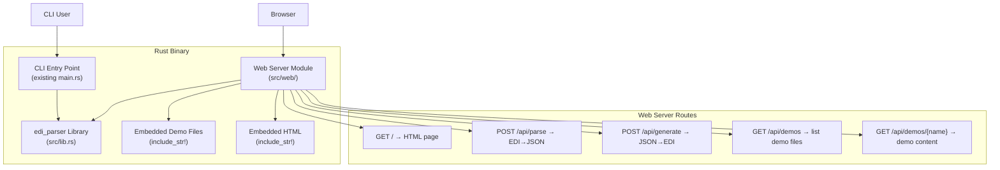
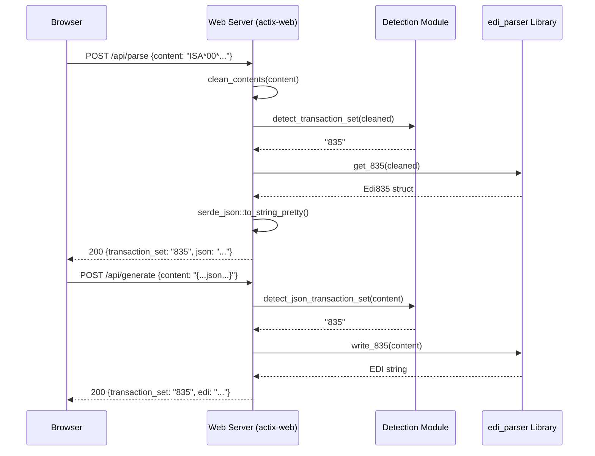

# Design Document: Web UI for EDI Parser

## Overview

This design adds a web-based user interface to the existing EDI Parser CLI application. The web UI is served as embedded HTML from the Rust binary itself — no separate frontend build step, no external static files. When the user passes `--web`, an actix-web HTTP server starts and serves a single-page HTML application with REST API endpoints for parsing EDI to JSON and generating EDI from JSON.

The design preserves full backward compatibility: without `--web`, the application behaves identically to the current CLI. The web server reuses the existing `edi_parser` library functions (`get_835`, `write_835`, etc.) and the `clean_contents` helper, ensuring the web UI produces the same results as the CLI.

### Key Design Decisions

1. **Embedded HTML via `include_str!`**: The entire frontend is a single HTML file compiled into the binary using Rust's `include_str!` macro. This avoids any runtime file dependencies and keeps deployment as a single binary.
2. **actix-web 4**: Chosen as the HTTP framework — it's mature, well-maintained (latest v4.11), async, and lightweight. It integrates naturally with the existing serde-based data model.
3. **No separate frontend build**: All CSS and JavaScript are inline within the single HTML file. No npm, no bundler, no framework.
4. **Transaction set auto-detection**: Reuses the same content-inspection logic from `main.rs` (ST segment identifiers, implementation guide references, JSON field detection) extracted into shared functions.
5. **Demo files embedded at compile time**: Demo `.edi` files from the `demo/` directory are embedded into the binary using `include_str!`, so the web UI can serve them without filesystem access.

## Architecture



### Request Flow



## Components and Interfaces

### 1. Web Server Module (`src/web/`)

New module added to the binary crate (not the library crate). Contains:

- **`mod.rs`** — Module declarations
- **`server.rs`** — actix-web server setup, route configuration, startup logic
- **`handlers.rs`** — Request handler functions for each API endpoint
- **`detection.rs`** — Transaction set auto-detection from EDI content and JSON content
- **`models.rs`** — Request/response structs for the API

#### Server Setup (`server.rs`)

```rust
pub struct WebConfig {
    pub port: u16,
}

pub async fn start_server(config: WebConfig) -> std::io::Result<()> {
    // Bind to 0.0.0.0:{port}, configure routes, start actix-web
}
```

#### API Handlers (`handlers.rs`)

| Handler | Route | Method | Description |
|---------|-------|--------|-------------|
| `index` | `/` | GET | Returns embedded HTML page |
| `parse_edi` | `/api/parse` | POST | Accepts EDI content, returns JSON |
| `generate_edi` | `/api/generate` | POST | Accepts JSON content, returns EDI |
| `list_demos` | `/api/demos` | GET | Returns list of available demo files |
| `get_demo` | `/api/demos/{filename}` | GET | Returns content of a specific demo file |

#### Detection Module (`detection.rs`)

Extracts the transaction set detection logic currently duplicated in `main.rs` into reusable functions:

```rust
/// Detect transaction set type from raw EDI content
pub fn detect_edi_transaction_set(contents: &str) -> Result<&'static str, String>

/// Detect transaction set type from JSON content
pub fn detect_json_transaction_set(contents: &str) -> Result<&'static str, String>
```

Detection logic for EDI (from existing `main.rs` patterns):
- `ST*835*` → "835"
- `ST*999*` → "999"
- `ST*270*` → "270"
- `ST*271*` → "271"
- `ST*276*` → "276"
- `ST*277*` → "277"
- `ST*837*` + `005010X222` → "837P"
- `ST*837*` + `005010X223` → "837I"
- `ST*837*` + `005010X224` → "837D"
- `ST*278*` → "278"
- `ST*820*` → "820"
- `ST*834*` → "834"

Detection logic for JSON (from existing `main.rs` patterns):
- `"transaction_set_id":"835"` → "835"
- `"transaction_set_id":"999"` → "999"
- `"transaction_set_id":"270"` → "270"
- `"transaction_set_id":"271"` → "271"
- `"st01_transaction_set_identifier_code":"276"` → "276"
- `"st01_transaction_set_identifier_code":"277"` → "277"
- `"transaction_set_id":"278"` → "278"
- `"transaction_set_id":"820"` → "820"
- `"transaction_set_id":"834"` → "834"
- 837 variants detected by `"cl1":` (837I), `"too_segments":` (837D), or default 837P

### 2. CLI Argument Extension (`src/helper/helper.rs`)

Extend the existing `Args` struct and `process_args()` to support:

```rust
pub struct Args {
    // ... existing fields ...
    pub web_mode: bool,
    pub port: u16,  // default 8080
}
```

New flags:
- `--web` — Start web server instead of CLI processing
- `--port <PORT>` — Set web server port (default: 8080)

### 3. Embedded HTML Frontend (`src/web/index.html`)

A single self-contained HTML file with inline CSS and JavaScript. Compiled into the binary via `include_str!("index.html")`.

**UI Layout:**
- Header with application title
- Mode selector (Parse EDI → JSON / Generate JSON → EDI)
- Demo file dropdown selector
- Input text area with label
- Action button (Parse / Generate)
- Output text area (read-only) with label
- Copy-to-clipboard button
- Download button
- Error display region (ARIA live region)

**Accessibility:**
- Semantic HTML (`<main>`, `<form>`, `<label>`, `<button>`, `<output>`)
- ARIA attributes on dynamic regions (`aria-live="polite"` for errors, `role="status"`)
- Keyboard navigation (tab order, Enter to submit)
- Visible focus indicators via CSS `:focus-visible`
- Responsive layout using CSS flexbox/grid with media queries

### 4. Embedded Demo Files

Demo files are embedded at compile time using a macro pattern:

```rust
const DEMO_FILES: &[(&str, &str)] = &[
    ("edi270-demo-005010X279.edi", include_str!("../../demo/edi270-demo-005010X279.edi")),
    ("edi271-demo-005010X279.edi", include_str!("../../demo/edi271-demo-005010X279.edi")),
    // ... all 12 demo files
];
```

### 5. Main Entry Point Changes (`src/main.rs`)

The `main()` function gains a check for `--web` mode:

```rust
fn main() {
    set_logger();
    let args = process_args();

    if args.web_mode {
        // Start actix-web server (requires tokio runtime)
        start_web_server(args.port);
    } else {
        // Existing CLI logic (unchanged)
        // ...
    }
}
```

The existing CLI code path remains completely untouched.

## Data Models

### API Request/Response Models

```rust
/// Request body for POST /api/parse
#[derive(Deserialize)]
pub struct ParseRequest {
    pub content: String,
}

/// Request body for POST /api/generate
#[derive(Deserialize)]
pub struct GenerateRequest {
    pub content: String,
}

/// Successful response for parse/generate operations
#[derive(Serialize)]
pub struct SuccessResponse {
    pub transaction_set: String,
    pub output: String,
}

/// Error response
#[derive(Serialize)]
pub struct ErrorResponse {
    pub error: String,
}

/// Demo file list item
#[derive(Serialize)]
pub struct DemoFile {
    pub filename: String,
}

/// Response for GET /api/demos
#[derive(Serialize)]
pub struct DemoListResponse {
    pub demos: Vec<DemoFile>,
}

/// Response for GET /api/demos/{filename}
#[derive(Serialize)]
pub struct DemoContentResponse {
    pub filename: String,
    pub content: String,
}
```

### Existing Data Models (Unchanged)

All existing transaction set structs (`Edi835`, `Edi999`, `Edi270`, etc.) remain unchanged. The web handlers serialize/deserialize them using the same serde implementations already in place.


## Correctness Properties

*A property is a characteristic or behavior that should hold true across all valid executions of a system — essentially, a formal statement about what the system should do. Properties serve as the bridge between human-readable specifications and machine-verifiable correctness guarantees.*

### Property 1: EDI transaction set detection correctness

*For any* EDI content string containing a valid ST segment with a supported transaction set identifier (835, 999, 270, 271, 276, 277, 837 with implementation guide variant, 278, 820, 834), `detect_edi_transaction_set` shall return the correct transaction set type matching the ST segment identifier and implementation guide reference.

**Validates: Requirements 4.1**

### Property 2: JSON transaction set detection correctness

*For any* JSON content string containing a valid transaction set identifier field (`transaction_set_id`, `st01_transaction_set_identifier_code`, or 837 variant markers), `detect_json_transaction_set` shall return the correct transaction set type matching the identifier.

**Validates: Requirements 4.2**

### Property 3: Parse API equivalence with library

*For any* valid EDI content for a supported transaction set, submitting it to the Parse API (`POST /api/parse`) shall produce JSON output identical to calling the corresponding `get_*` library function directly with the same cleaned content.

**Validates: Requirements 2.3**

### Property 4: Generate API equivalence with library

*For any* valid JSON content for a supported transaction set, submitting it to the Generate API (`POST /api/generate`) shall produce EDI output identical to calling the corresponding `write_*` library function directly with the same content.

**Validates: Requirements 3.3**

### Property 5: Unrecognized input returns error with supported types

*For any* string that does not contain a valid transaction set identifier (for EDI: no recognized ST segment; for JSON: no recognized transaction set field), the Parse API or Generate API shall return HTTP 400 with an error message that lists the supported transaction set types.

**Validates: Requirements 2.5, 3.5, 4.4**

### Property 6: Non-existent demo file returns 404

*For any* filename string that does not match one of the embedded demo file names, `GET /api/demos/{filename}` shall return HTTP 404 with an error message.

**Validates: Requirements 5.5**

## Error Handling

### API Error Responses

All API errors return a JSON body with the `ErrorResponse` structure and an appropriate HTTP status code:

| Scenario | HTTP Status | Error Message |
|----------|-------------|---------------|
| Empty input to parse/generate | 400 | "Input is required. Please provide EDI or JSON content." |
| Unrecognized EDI format | 400 | "Unrecognized EDI format. Supported transaction sets: 835, 999, 270, 271, 276, 277, 278, 837P, 837I, 837D, 820, 834" |
| Unrecognized JSON format | 400 | "Unrecognized JSON format. Supported transaction sets: 835, 999, 270, 271, 276, 277, 278, 837P, 837I, 837D, 820, 834" |
| Malformed JSON | 400 | "Invalid JSON: {serde error details}" |
| Parse/generation library error | 400 | "Processing error: {error details}" |
| Demo file not found | 404 | "Demo file not found: {filename}" |
| Port already in use | Startup error | "Failed to bind to port {port}: address already in use" |

### Error Propagation Strategy

1. **Library errors**: The existing `EdiError` type is converted to `ErrorResponse` with HTTP 400. The `Display` implementation on `EdiError` provides the error message.
2. **Serde errors**: JSON deserialization failures are caught and returned as 400 with the serde error message.
3. **Server errors**: actix-web's built-in error handling covers unexpected panics and internal errors with HTTP 500.
4. **Frontend errors**: JavaScript `fetch` failures (network errors) are caught in the `catch` block and displayed in the ARIA live error region.

### Input Validation

Validation is performed in the handler functions before calling library code:

1. **Empty check**: If `content` field is empty or whitespace-only, return 400 immediately.
2. **Detection check**: If transaction set cannot be detected, return 400 with supported types list.
3. **Library call**: Wrap in error handling to catch parse/generation failures.

## Testing Strategy

### Property-Based Tests

Property-based testing applies to the pure logic components of this feature — specifically the transaction set detection functions and the API handler logic. Use the `proptest` crate (well-established PBT library for Rust).

**Configuration:**
- Minimum 100 iterations per property test
- Each test tagged with: `// Feature: web-ui, Property {N}: {title}`

**Properties to implement:**
- Property 1: EDI detection — generate EDI strings with known ST segments, verify correct detection
- Property 2: JSON detection — generate JSON strings with known transaction set fields, verify correct detection
- Property 3: Parse equivalence — use demo file contents, verify API output matches direct library call
- Property 4: Generate equivalence — parse demo files to JSON first, then verify generate API output matches direct library call
- Property 5: Invalid input rejection — generate random strings without valid identifiers, verify 400 response
- Property 6: Non-existent demo files — generate random filenames, verify 404 response

### Unit Tests (Example-Based)

Unit tests cover specific examples and edge cases. Tests are placed in the same file as the code per Rust conventions.

| Test | Validates |
|------|-----------|
| `test_index_returns_html` | Req 1.2 — GET / returns HTML with 200 |
| `test_parse_empty_input` | Req 2.6 — Empty EDI returns 400 |
| `test_generate_empty_input` | Req 3.6 — Empty JSON returns 400 |
| `test_list_demos` | Req 5.4 — GET /api/demos returns all 12 demo files |
| `test_get_demo_file` | Req 5.2 — GET /api/demos/{name} returns correct content |
| `test_parse_each_transaction_set` | Req 2.2 — Each demo file parses successfully |
| `test_generate_each_transaction_set` | Req 3.2 — Each transaction set generates successfully |
| `test_web_flag_not_provided` | Req 1.4 — Without --web, CLI behavior unchanged |
| `test_port_in_use` | Req 1.5 — Port conflict produces error |
| `test_response_includes_transaction_set` | Req 4.3 — Response contains detected type |

### Integration Tests

Integration tests verify the full HTTP request/response cycle using actix-web's test utilities (`actix_web::test`):

- Start test server with `test::init_service`
- Send HTTP requests to each endpoint
- Verify status codes, headers, and response bodies
- Test with all 12 demo files as representative inputs

### What Is NOT Tested with PBT

- UI rendering, layout, and accessibility (Req 6.x, 7.x) — requires manual testing and visual review
- Clipboard and download functionality (Req 6.1–6.5) — browser-specific JavaScript behavior
- ARIA live region announcements (Req 8.2) — requires screen reader testing
- Server startup and logging (Req 1.1, 1.3) — integration/smoke tests only
- Responsive layout (Req 7.3) — requires visual regression testing
